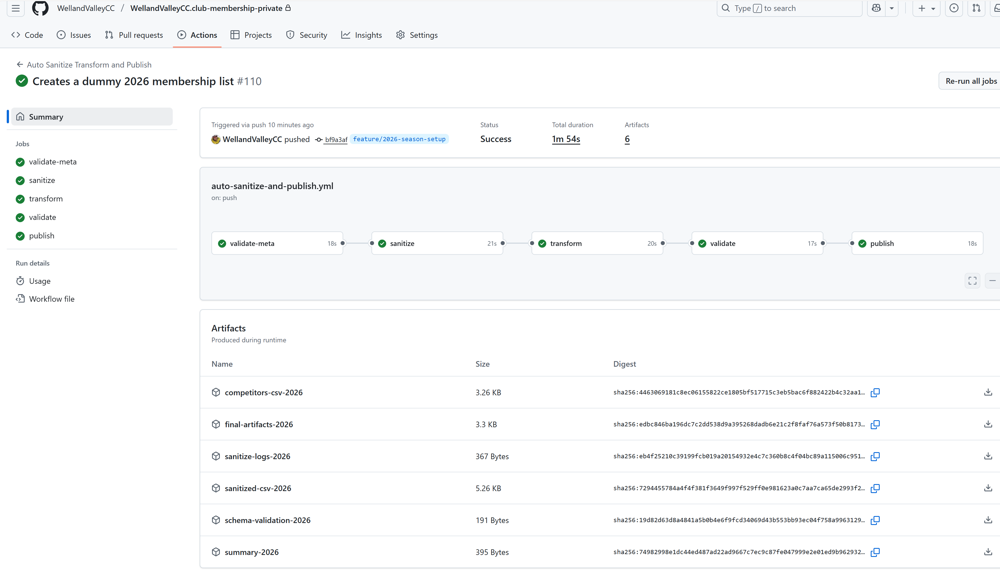
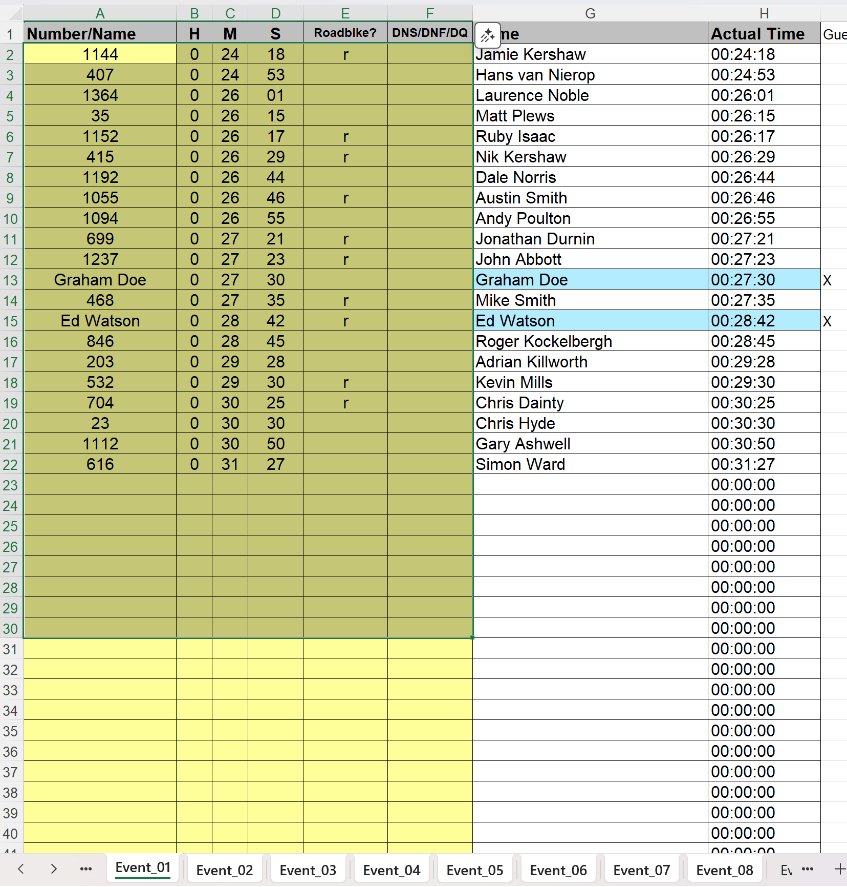
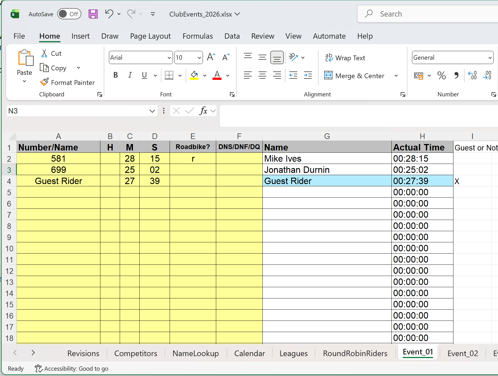
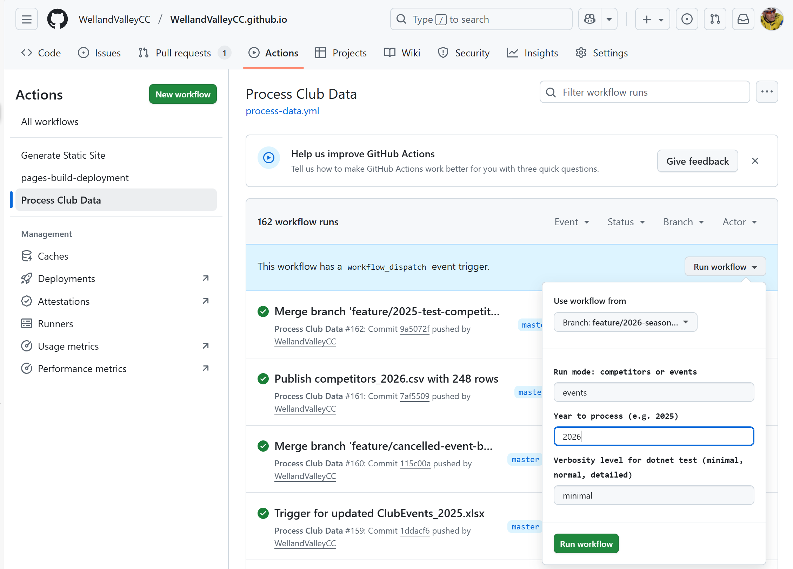

# How to set up a new season
This guide will walk you through the steps necessary to set up a new season. 
## Prerequisites
- Draft calendar for the new season.
	- This will usually be available from the TT committee, perhaps via email.
- The private repository for the club membership data
	- Clone this from https://github.com/WellandValleyCC/WellandValleyCC.club-membership-private - branch `main`
	- Let's assume it's been cloned to: "C:\repos\wvcc\WellandValleyCC.club-membership-private
- The public repository for the club website
	- Clone this from https://github.com/WellandValleyCC/WellandValleyCC.github.io - branch `master`
	- Let's assume it's been cloned to: "C:\repos\wvcc\WellandValleyCC.github.io"
	- Note that this repository maintains two active branches
		- `master` - this is the code behind processing events and generating the live website 
		- `gh-pages` - this is the live website itself, hosted by github pages
## Required Data Files
- Previous season's membership Excel workbook
	- This is usually stored in the private membership repository.
	- e.g. "C:\repos\wvcc\WellandValleyCC.club-membership-private\data\25.01.14 2025 membership list.xlsx"
- Previous season's events data Excel workbook
	- This will be available in this repository, the public github io repository.
	- e.g. "C:\repos\wvcc\WellandValleyCC.github.io\data\ClubEvents_2025.xlsx"
## Steps to Set Up a New Season
### 1: Create New Membership Workbook
1. Create a new feature branch in the private membership repository for the new season.  e.g. "feature/2026-season-setup"
2. Copy/rename the previous season's membership workbook to reflect the new season.
  - e.g. Copy "25.01.14 2025 membership list.xlsx" to "dummy 2026 membership list.xlsx"
  - The club membership secretary will supply the correct file in January of the coming year, well before the season starts.
  - Place the new workbook in the same directory as the previous one.
  - It will be adequate to leave the data as it is for now - we just need to be able to simulate some events to be sure everything is set up correctly.
3. Edit "C:\repos\wvcc\WellandValleyCC.club-membership-private\data\competitors.meta.json" to reference 
the new dummy membership file, with "use_simulated_import_date" set to false.
  - There is no need to force a specific import date, as the new season will not start until 2026.
  - Sample contents of the updated "competitors.meta.json" file:

``` json
{
  "source": "dummy 2026 membership list.xlsx",
  "use_simulated_import_date": false,
  "simulated_import_date": "2025-12-09"
}
```
4. Commit and push the changes to the feature branch.
  - pipeline will run to push the public membership csv to the public repository.
  - e.g. https://github.com/WellandValleyCC/WellandValleyCC.club-membership-private/actions/runs/20066947127
5. Confirm pipeline runs.
  - The run viewed on GitHub Actions for the private repository: (https://github.com/WellandValleyCC/WellandValleyCC.club-membership-private/actions/runs/20066947127)

	- Git commits in the public repository:

```
$ git log master -n 2 --oneline
c095a7a8 (origin/master, origin/HEAD, master) Persisted competitor DB for 2026 import [ci skip]
7af55094 Publish competitors_2026.csv with 248 rows
```

  - Note the pipeline run in the private repository automatically pushed the updated competitors_2026.csv to the public repository.
  - Which in turn, triggered a [new run of action Process Club Data](https://github.com/WellandValleyCC/WellandValleyCC.github.io/actions/runs/20067006338/job/57558181456#step:10:73), resulting in the updated competitor database being persisted for 2026 
    - Note how the Action detects the new competitors_2026.csv file and processes it accordingly to generate the competitor database for 2026.

### 2: Create New Events Workbook
1. Create a new feature branch in the github io repository for the new season.  e.g. "feature/2026-season-setup"

2. Copy/rename the previous season's events workbook to reflect the new season.
  - e.g. Copy "ClubEvents_2025.xlsx" to "ClubEvents_2026.xlsx"
  - Place the new workbook in the "data" directory of the public repository.
	
3. Open the new events workbook in Excel

4. Select all the event sheets (`Event_01`, `Event_02`, ...) and clear out the yellow data cells.
  - Make sure to select all the way down the rows to the bottom of the sheet, so that no old data remains.
  

5. Go to the Calendar sheet and update as per the draft data supplied by the TT committee.
  - At this stage, it does not matter if some of this will change as the committee finalises the calendar.
  
  - Ultimately, you need to make sure that the distance column is a numeric value.  
	- if you're dealing with a 5+5, this value will be 10, and you'll need to update the Evening 10 and Non-Standard 10 columns manually to stop it being treated as a standard 10 mile event. But in these preliminary stages, it is okay to leave it as "5 + 5".
  - Similarly the date column needs to be a valid date, but it can be a rough indicator such as "TBC June" for now - the processing will still work, but will skip this event.
  - You may need to add additional `Event_nn` sheets.  
  - Do this by copy/pasting an existing `Event_nn` sheet to ensure all cells are set up as required. 
  - Just make sure they are named sequentially and align with the event numbers in the Calendar sheet.
  - Keep the event numbers sequential and contiguous in the Calendar sheet.

6. Open .\data\competitors_2026.csv in Excel and copy the data from the sheet (competitors_2026) into the Competitors sheet in the new events workbook.
  - It's important to copy all the data, including the header row, overwriting any existing data in the Competitors sheet.  This keeps references in the `Event_nn` sheets working 
  - Do not _copy/move_ the sheet from the csv into the workbook in its entirety and then use sheet renaming - this will break references in the `Event_nn` sheets.

## Test the New Season Setup
1. Edit the "ClubEvents_2026.xlsx" workbook to add some test data to the first event.
  - i.e. Add some test rides to `Event_01`
  
  - Save the workbook.
2. Commit and push the changes to the feature branch.
1. Trigger the `Process Club Data` action manually for the feature branch
  
	- branch : `feature/2026-season-setup`
	- run mode : `events`
	- year : `2026`
	- verborsity level : `minimal`