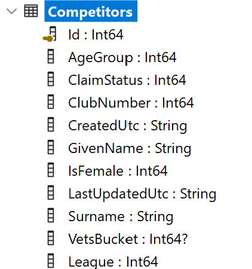
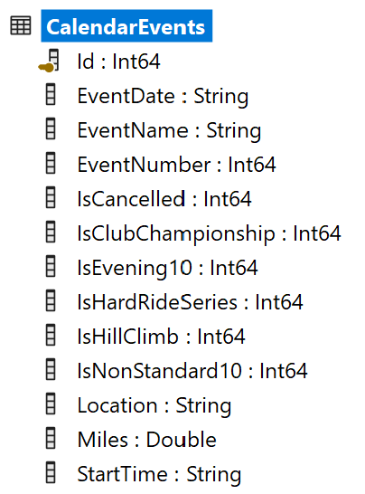
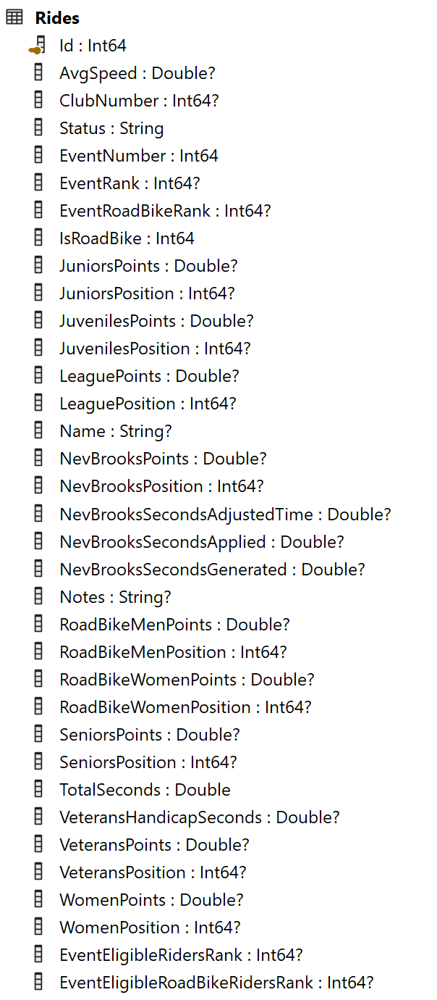
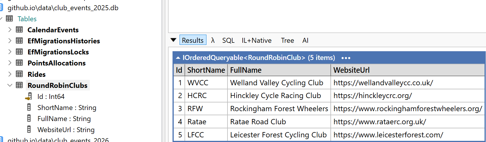

# Round Robin README

The Round Robin competitions are not WVCC specific, but for reasons of practicality, it makes sense to process them alongside the WVCC competitions.
A key design goal, however, is to not pollute the WVCC specific implementation with `ClubProcessor`, so that other clubs wishing to adopt this cloud-based competition system can do so.

## ClubProcessor before Round Robin support

The initial implementation of ClubProcessor, as developed in readiness for 2026 season, operates in two modes:

- --mode competitors
- --mode events

### Mode: competitors
In `--mode competitors`, the processor reads `competitors_YYYY.csv` and populates the `club_competitors_YYYY.db` SQLite database - specifically the `Competitors` table.

<!--


-->


### Mode: events
In `--mode events`, the processor reads `ClubEvents_YYYY.xlsx` and populates the `club_events_YYYY.db` SQLite database - specifically the `CalendarEvents` and `Rides` tables.

<table>
  <tr>
    <td valign="top">
      
    </td>
    <td valign="top">
      
    </td>
  </tr>
</table>

## Round Robin enhancements 

To support round robin competitors, the following enhancements were made:

- [x] ClubEvents_YYYY.xlsx enhancements
- [x] Github pipeline script enhanced
- [ ] 

### ClubEvents_YYYY.xlsx enhancements

- [x] RoundRobinRiders sheet added
- [x] Calendar sheet enhanced with RoundRobinEvent and RoundRobinClub columns

#### RoundRobinRiders sheet - isFemale column

The `ClubEvents_YYYY.xlsx` files already included details of round robin riders from clubs other than WVCC.  This was used only within the .xlsx workbook to improve the names presented for members of other clubs appearing as guest riders in the event pages.  This has been extended to include an `isFemale` boolean column since the RR competitions include a female-only competition and the interclub competition also takes the score of the fastest female from each club at an event.


#### Calendar sheet - RoundRobinEvent and RoundRobinClub columns


This sheet has been extended with two new columns:

- `Round Robin Event` - string (`Y` or blank) - indicates whether this event is a round robin event.
- `Round Robin Club` - string - indicates the club organising the event (e.g. `Ratae`, `LFCC`, `WVCC`, etc.)


#### Event sheets - new Raw Name column to simplify results entry

These sheets have an additional column `Number/Raw Name`:


And column A (`Number/Name`) has been updated to make use of a formula:
```
=IF(J2="","",XLOOKUP(J2,ClubNames,ClubNumbers,XLOOKUP(J2,RoundRobinRiderNames,RoundRobinRiderDecoratedNames,J2)))
```

This formula follows the following algorithm:

1.  Is the named rider a member of WVCC (`Competitors` sheet - populated with data from `Competitors_YYYY.csv`)?  Yes - use their member number. [ `Mike Ives` --> `581`].  This helps where club number was not provided at sign on.
2. Is the named rider present in the `RoundRobinRiders` sheet?  Yes - use their `Decorated Name` which includes their club name in parenthesis. [`John Doe` --> `John Doe (Ratae)`]
3. Otherwise - use the name.number 'as is'.  [`Geraint Thomas` --> `Geraint Thomas`; `581` --> `581`].  This is the 'right' way to enter a WVCC club member.

> [!TIP]
>
> When entering event results, enter WVCC club numbers, or (for guests) names in column J initially to make use of this lookup algorithm.  
> 
> Overwrite the formula in column `A` with the rider's name if, at the time of the event, the rider is *not* a member of a club (WVCC or other Round Robin club).  This prevents issues if the rider later joins WVCC or one of the other clubs, where the formula would make it appear as though their membership was back-dated.

### Github pipeline script enhanced 

- [x] Python script extracts RoundRobinRiders sheet to CSV

The Python script `scripts\extract_club_events.py` now extracts the RoundRobinRiders sheet to a CSV file named `RoundRobinRiders_{YYYY}.csv`

``` csv
Name,Club,Decorated Name,isFemale
John Doe,Ratae,John Doe (Ratae),False
Jane Doe,LFCC,Jane Doe (LFCC),True
```

### `--mode events` enhanced

- [ ] Additional columns in CalendarEvents table (populated from Calendar sheet)
- [ ] RoundRobinRiders table added to club_events_YYYY.db - new migration
- [ ] RoundRobinRiders table populated from RoundRobinRiders_{YYYY}.csv and Competitors table
- [ ] Rides table - additional properties

#### Enhanced CalendarEvents table

This needs a new migration to add the following columns to the CalendarEvents table:

- IsRoundRobinEvent - boolean
- RoundRobinClub - string

Also, extensions to the corresponding csv handler class `\processor\ClubCore\Models\Csv\CalendarEventCsv.cs`, and code in `\processor\ClubProcessor\Services\CalendarImporter.cs` to validate the supplied Club Name (if present) against the list of clubs defined in RoundRobinClubs (plus implicitly "WVCC").

> - [!NOTE]
> Since the hosting of one event in the 2025 season was shared by Ratae and WVCC, this should be capable of handling a CSV list of club names.

Validation should ensure that the club name used in this Round Robin Club column is a recognised round robin participating club.

#### New RoundRobinRiders table

- [ ] to do

This table will be populated from the `RoundRobinRiders_{YYYY}.csv` file.  These riders are from clubs other than WVCC, so they will not appear in the `Competitors` table.

> [!NOTE]
> When scoring the RoundRobin competitions, the `RoundRobinRiders` table will be used in conjunction with the `Competitors` table. 

What to do about WVCC riders concept of dates when they sign up?  Do we need this concept for other clubs?  For now, we will assume that all non-WVCC riders are in their club for all RR events.  We could always use a different name in the event pages if we need to.

New class `RoundRobinRiderImporter` based on `\processor\ClubProcessor\Services\CompetitorImporter.cs`

#### Rides table - additional properties

- `Club` - the name of the club to which the rider belongs.  This will be `WVCC` for club members.  For guest riders, this will be whatever string appears in parentheses in their name (column A of the Event sheets).  E.g. "John Doe (Ratae)" --> `Ratae`; "Jane Doe (HCRC)" --> `HCRC`.
- `RoundRobinPosition` - this will store the position of the rider in the event, if (and only if) the `Club` is a participant club for the RoundRobin competition.
- `RoundRobinPoints` - the points for the position (60, 55, 51 etc.) - normal rules apply for draws.
- `RoundRobinWomenPosition` - this will store the position of the rider in the event, if (and only if) the `Club` is a participant club for the RoundRobin competition *and* the rider `IsFemale` (looked up in `Competitors` table for `WVCC` riders, or `RoundRobinRiders` table for riders from other clubs)
- `RoundRobinWomenPoints` - the points for the position (60, 55, 51 etc.) - normal rules apply for draws.

#### New RoundRobinClubs table

Populated automatically by the ClubProcessor with the five clubs currently in the Round Robin series (`WVCC`, `HCRC`, `RFW`, `Ratae`, `LFCC`)



If a Ride is done by a member of one of these clubs, then it will have the RoundRobin scoring columns filled in by the Round Robin calculator classes.  

This table is used for validation of club names used in the Calendar worksheet.  And also used to identify riders as being eligible for the round robin competition.  

> [!NOTE] The events importer (`\processor\ClubProcessor\Services\EventsImporter.cs`) will process the rider names from the event CSV sheet and use any parentherical suffix as a club name.  E.g. "John Doe (Ratae)" --> `Ratae`, "Geraint Thomas (IGD)" --> `IGD`. If the rider's club identified this way is not part of the round robin series, then the Ride object will *not* have the new Club property set.  Thus, their name in the event html will still include their club in parentheses, but since the club is not one of the known RR clubs, they will not be included in scoring for RR.

### RideProcessing enhancements

Needs two new `IRideProcessor` derived classes to populate the new Ride scoring columns: 

'RoundRobinOpenScoreCalculator' - will process all rides by members of WVCC (any claim status) and by riders with a RoundRobinClub identified.  Sets the `RoundRobinPosition` and `RoundRobinPoints`.

'RoundRobinWomenScoreCalculator' - will process all rides by IsFemale members of WVCC (any claim status) and by IsFemale riders with a RoundRobinClub identified.  Sets the `RoundRobinWomenPosition` and `RoundRobinWomenPoints`.  This will need to hydrate rides with `RoundRobinRiders` table - so an extension to `RideProcessingCoordinator` where we already have the following:

```
        public void ProcessAll(
            IEnumerable<Ride> rides, 
            IEnumerable<Competitor> competitors, 
            IEnumerable<CalendarEvent> calendarEvents)
        {
            RideHydrationHelper.HydrateCalendarEvents(rides, calendarEvents);
            RideHydrationHelper.HydrateCompetitors(rides, competitors);

            var ridesByEvent = rides
                .GroupBy(r => r.EventNumber)
                .OrderBy(g => g.Key);
```

